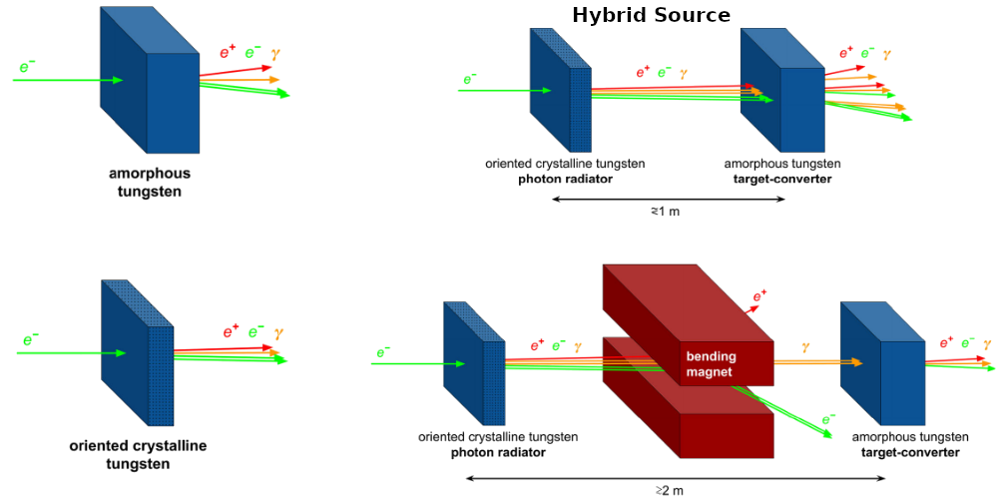
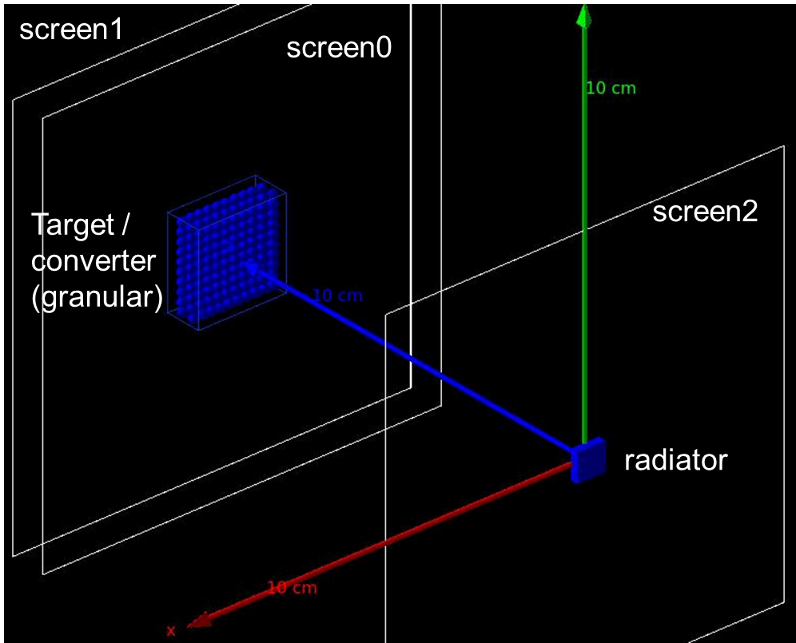
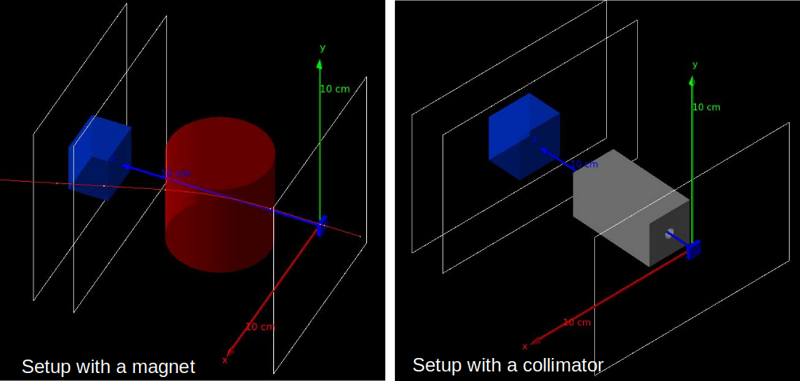

## PositronSource
PositronSource is a [Geant4](http://www.geant4.org/geant4/) application to simulate a positron source following the conventional approach, which relies on an amorphous target, and a positron source based on oriented crystals. In the latter case, both the single-crystal and the hybrid scheme can be investigated. 

<p align="center">
    
</p>

Both Geant4 and [CMake](https://cmake.org/) need to be installed on your machine in order to compile and run the software.
Tested with:
[](https://geant4.web.cern.ch/) [](https://cmake.org/)

The source code can be downloaded either as a ZIP archive, from the Code drop-down menu (look at the green box above), or directly from the terminal (open in your project working directory) via:
```
git clone git@github.com:paternog/PositronSource.git
```
Note: the latter requires [Git](https://git-scm.com/) installed on your machine.

### Settings
The application is thought to be used without the need of a deep understaing of how a Geant4 simulation works. Indeed, through a set of custom macro commands, the user can define the geometry and the physics he wants to use (see the macro run.mac inside the macros folder). 

### Geomtery
The application can be used to simulate a positron source. One or two volumes can be present, depending if the user wants to consider a conventional/single-oriented-crystal sheme or the hybrid scheme. In the hybrid scheme, the first volume is a crystal typically oriented along a crystalline axis that serves as a radiator, whereas the second volume is a randomly oriented crystal where the photons emitted by the radiator are converted into positrons. The converter can be composed of small spheres (the so called granular target) so as to reduce the energy deposition and the thermomechanical stress. In addition, from one to three scoring screens are present to score the particle leaving or enetering the aformentioned volumes (see the figure below).

<p align="center">
    
</p>

An "advanved hybrid scheme" that includes an ideal bending magnet or a collimtor to remove the charged particle or limit the number of particles impinging on the converter, respectively, can also be considered. 

<p align="center">
    
</p>

A set of macros commands can be used to set the magnet and the collimator features (see macros/run.mac).

### Physics
There are many settings that can be used to tune the simulation of particle interactions inside oriented crystals.
A series of commands can be used to tag the particles and simulate their trajectories. In this case, a text file will be produced at the end of the run with the following columns:
```
"volume", "eventID", "trackID", "x [mm]", "tx [rad], "z [mm]", "xx [mm]", "yy [mm]""
```
In order to plot the trajectory use z and xx variables, while for tagging use x, tx and z.

Some important parameters of the Bair-Katkov (BK) model for radiation simulation can also be set (see the run.mac macro), for instance the minimum photon energy the crystal can emit (`/crystal/setLEth 0.3 MeV`) or the number of small steps of the particle trajectory before radiation probability is evualeted with BK (`/crystal/setNSmallTrajectorySteps 1000`).

The [G4ChannelingFastSimModel] (http://www.geant4.org/geant4/) can be deactivated through the macro command: `/crystal/setOCeffects false`. This is very useful to simulate the random/amorphous case without changing the angles with respect to selected orientation (with `/crystal/setCrystalAngleX angX_rad`, `/crystal/setCrystalAngleY angY_rad` commands).

For the other interactions, standard Geant4 physics model are used. In particular `FTFP_BERT` has been selected as base physics list and the electromagnetic models has been chosen among the `Livermore` ones.

### Event generation
The beam features (primary particles) have to be set through standard `G4GeneralParticleSource` (gps) commands as in the run.mac macro.

### Output
PositronSource is optimised for an ntuple-based output, in which data from sensitive detectors are written event by event. The default output file format is the [ROOT](https://root.cern/) file (`.root`), which contains the ntuples as [tree objects](https://root.cern.ch/doc/master/classTTree.html). The output file is saved in `output/` (in the build path) at the end of the program execution; its name can be set in through the command `/run/setfilenamesave output/NAME_YOU_WANT.root`. Alternatively, different file formats can be chosen, e.g. the CSV. 

The output file contains five ntuples. 

The ntuple `scoring_ntuple` is used to score the features of the particles impingning on the scoring screens. It contains the following variables (columns):
```
"screenID", "particle", "x", "y", "px", "py", "pz", "t", "eventID"    
```
Which represents:
- the screen ID (column 0),
- the particle name (column 1),
- the impinging x,y coordinates in mm (columns 2,3),
- the momentum components (MeV) of the particle (columns 4-6),
- the time of arrival of the particle in ns (column 7),
- the event ID (column 9).

The ntuple `edep_rad` and `edep_conv` are used to store the energy deposited (MeV) in radiator and converter, respectively, thus they contain simply the variables:
```
"edep", "eventID"    
```
The ntuple `edep_spheres` is instead used to store the energy deposited (MeV) inside the spheres of a granular target/converter. It contains the variables:
```
"volumeID", "edep", "eventID"    
```
where volumeID identify the single sphere inside the target. This ntuple is filled only if the target is indeed granular (it can be activated through the command `/det/setGranularConverter true`).

Fianlly, the ntuple `scoring_ntuple2` is used to score the features of the particles leaving the radiator or the target/converter. It contains the following variables (columns):
```
"particle", "x", "y", "z", "px", "py", "pz", "t", "eventID", "trackID" 
```
Which represents:
- the particle name (column 0),
- the impinging x,y,z coordinates in mm (columns 1-3),
- the momentum components (MeV) of the particle (columns 4-6),
- the time of arrival of the particle in ns (column 7),
- the event ID (column 8),
- the track ID (column 9).

The three-dimensional distributions of energy deposition in the converter (radiator if the converter is not present)  can be scored through the custom `VoxelScorer` class, which is similar to the native box mesh scorer, but, unlike the latter, is intrinsically linked to a volume, thus it is less prone to positioning errors. This modality can be turned on and off through the macro command: `/det/setVoxelization true or false`. Also, specific commands allow the user to define the number of voxels in the three directions (see the general macro: macos/run.mac). The same quantity can also be scored through the standard box mesh scorer defined in the attached macros.

## Analysis scripts
A series of python notebooks and custom libraries useful for the simulation result analysis is provided. The code is commented and require only the setting of proper input parameters, which are mainly located at the beginning of the notebook, well separed from calculations. 

## Quick Start
Create a directory where you want to have both the source code and the working (build) directory (e.g. geant4-apps) and move (from terminal) to this path, then clone the repository with:
```
git clone git@github.com:paternog/PositronSource.git
```
Create the build directory and move to this path:
```
mkdir PositronSource-build
cd PositronSource-build
```
Create the makefile with Cmake and compile the application:
```
cmake ../PositronSource
make -j[Ncores]
```
Run the app GUI which will show you a default geometry. You could also launch a test particle by selecting from the menu Run>Beam and then pushing the green "play" button on the command bar or typing `/run/beanOn 1` in the UI terminal (where you see "Session:").

## Version
version: 1.0,
date: 10-12-2024

## Acknowledgement
The code has been developed in collaboration with Alexei Sytov, who acknowledges support from H2020-MSCA-GF TRILLION (G.A. 101032975) project. We also acknowledges support from the INFN-CSN5 (GEANT4INFN project) and the European Union – NextGenerationEU – Project Title : ‘‘Intense positron source Based On Oriented crySTals - e+BOOST’’ 2022Y87K7X – CUP I53D23001510006.

## Contact
For any question, comment, suggestion or bug report, please contact me at <paterno@fe.infn.it>. 
